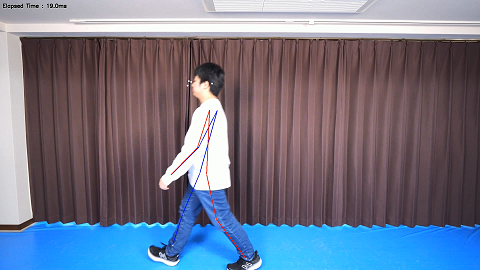
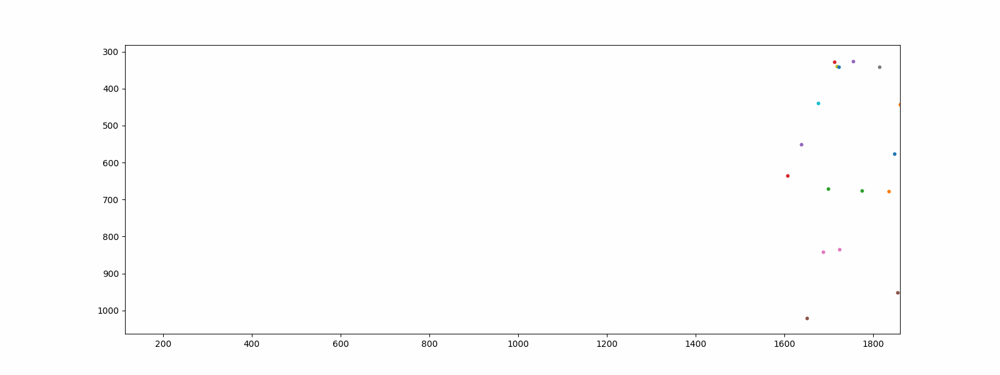

# 2024年 5月 雑誌 [interface](https://interface.cqpub.co.jp/) 向けコード 現場プロの画像処理100（仮）

## 要件

画像処理，AI処理を分けてカウントしたいと思っています。

1. [姿勢推定情報の抽出](#姿勢推定情報の抽出)
2. [特徴量の抽出と人物照合](#特徴量の抽出と人物照合)

# 動作環境セットアップ

## python依存関係の解決
```
pip install -r requirements.txt
```
動作確認バージョンを念のため付記していますが、特にバージョン依存等はありません（試行時取得バージョン）。

# 姿勢推定情報の抽出

以下のコードおよびモデルを利用しています。

- [MoveNet-Python-Example](https://github.com/Kazuhito00/MoveNet-Python-Example) : estimate_pose.py の母体コードとして修正利用
- [ONNX-HRNET-Human-Pose-Estimation](https://github.com/ibaiGorordo/ONNX-HRNET-Human-Pose-Estimation): HRNET onnx推論コードを利用
- [PINTO_model_zoo](https://github.com/PINTO0309/PINTO_model_zoo): HRNet/Lite HRNet onnxモデルを取得
- [DAMO-YOLO-ONNX-Sample](https://github.com/Kazuhito00/DAMO-YOLO-ONNX-Sample): DAMO-YOLO推論コードおよびモデルを利用

## モデル配備

### MoveNetおよびDAMO-YOLOモデル
```
mkdir onnx
cd onnx
wget https://github.com/Kazuhito00/MoveNet-Python-Example/raw/main/onnx/movenet_singlepose_lightning_4.onnx
wget https://github.com/Kazuhito00/DAMO-YOLO-ONNX-Sample/blob/main/damoyolo/model/damoyolo_tinynasL20_T_418.onnx
```

### HRNet/Lite HRNetモデル

[PINTO_model_zoo](https://github.com/PINTO0309/PINTO_model_zoo)よりモデルディレクトリの内の`download.sh`を実行して取得・展開してください。

- [268_Lite-HRNet](https://github.com/PINTO0309/PINTO_model_zoo/tree/main/268_Lite-HRNet)
- [271_HRNet](https://github.com/PINTO0309/PINTO_model_zoo/tree/main/271_HRNet)


## 重畳動画とCSVファイルの取得
重畳動画とCSVファイルはコード実行パス配下の`debugs`、`csv`にそれぞれ出力されます。

### コード実行例
```
python estimate_pose.py --file interface_videos/A_1.mp4 --keypoint_score 0.0 --debug_output --csv --model_select 2
```

model_selectはそれぞれ以下のように対応しています。
別の同系統モデルでも利用は可能だと考えます。
```
       if model_select == 0:
            model_path = "onnx/movenet_singlepose_lightning_4.onnx"
            input_size = 192
        elif model_select == 1:
            model_path = "onnx/movenet_singlepose_thunder_4.onnx"
            input_size = 256
        elif model_select == 2:
            model_path = "onnx/litehrnet_18_coco_Nx256x192.onnx"
            yolo_path = "onnx/damoyolo_tinynasL20_T_418.onnx"
        elif model_select == 3:
            model_path = "onnx/hrnet_coco_w48_384x288.onnx"
            yolo_path = "onnx/damoyolo_tinynasL20_T_418.onnx"
```

### 重畳動画参考



### CSVファイル内容参考
```
cat csv/A_1.csv | more
frame_number,nose_x,nose_y,nose_conf,left_eye_x,left_eye_y,left_eye_conf,right_eye_x,right_eye_y,right_eye_conf,left_ear_x,left_ear_y,left_ear_conf,right_ear_x,right_ear_y,right_ear_conf,left_shoulder_x,left_shoulder_y,left_shoulder_conf,right_shoulder_x,right_shoulder_y,right_shoulder_conf,left_elbow_x,left_elbow_y,left_elbow_conf,right_elbow_x,right_elbow_y,right_elbow_conf,left_wrist_x,left_wrist_y,left_wrist_conf,right_wrist_x,right_wrist_y,right_wrist_conf,left_hip_x,left_hip_y,left_hip_conf,right_hip_x,right_hip_y,right_hip_conf,left_knee_x,left_knee_y,left_knee_conf,right_knee_x,right_knee_y,right_knee_conf,left_ankle_x,left_ankle_y,left_ankle_conf,right_ankle_x,right_ankle_y,right_ankle_conf
0,1721,341,0.42245978,1754,326,0.58175915,1712,327,0.57963926,1813,340,0.53507954,1718,339,0.34348637,1860,441,0.46571508,1676,438,0.47710404,1847,576,0.38557935,1638,550,0.4466851,1835,677,0.20385751,1607,635,0.46187034,1774,676,0.49937767,1697,670,0.42545134,1686,841,0.5424488,1723,835,0.39171275,1650,1020,0.54304403,1855,951,0.45132017
1,1695,341,0.54838777,1730,324,0.6398781,1689,325,0.58653307,1792,334,0.56611574,1699,333,0.36779,1837,439,0.4850201,1666,425,0.3702311,1846,581,0.42863387,1637,543,0.34322596,1795,695,0.29519293,1606,633,0.43505612,1754,677,0.5251442,1672,671,0.5427353,1709,849,0.58842784,1703,837,0.3515209,1667,1032,0.4859239,1796,955,0.48823303
2,1681,336,0.35007125,1711,318,0.45976126,1672,318,0.58253175,1768,332,0.6261512,1674,326,0.28464645,1798,434,0.3731395,1660,423,0.58527696,1856,574,0.35121065,1624,538,0.24173298,1803,697,0.3472525,1591,617,0.47504622,1737,677,0.5850502,1636,667,0.5085149,1692,843,0.5882794,1652,832,0.4899592,1675,1017,0.45458704,1759,943,0.46876293
:
```

## 外れ値の補正とスムージング（参考）
CSVファイルに出力された姿勢推定情報をスムージングします。

以下実行では`smooth`配下にスムージングされたCSVが出力されます（今回は利用しないです）。

### コード実行例
```
python smooth.py --file csv/ --output smooth/
```

## 姿勢推定の点群可視化（参考）
`visualize_pose.ipynb`を`jupyter`より実行し、任意のCSVファイルを選択して可視化ができます。



# 特徴量の抽出と人物照合

## 歩容特徴

以下の特徴量を出力します。

- 腕の振り（横）：左手の腰原点にしたときのX方向の最大と最小の差の最大値
- 腕の振り（縦）：左手の腰原点にしたときのY方向の最大と最小の差の最大値 
- 歩幅（右）：右足首の腰原点にしたときのX方向の最大と最小の差の最大値 
- 歩幅（左）：左足首の腰原点にしたときのX方向の最大と最小の差の最大値 
- 足の上がり方（右）：右足首の腰原点にしたときのY方向の最大と最小の差の最大値 
- 足の上がり方（左）：右足首の腰原点にしたときのY方向の最大と最小の差の最大値 
- 頭の上下：左目のY方向の最大と最小の差の最大値

## 処理概要

- 任意のディレクトリより、任意のCSVファイル接尾（デフォルト値:`_1.csv`）を持たないCSVファイルをすべて姿勢推定結果の点群として読み込みます。
- 姿勢推定結果の点群から、左右の足首距離を計算し、フーリエ変換し周期（整数に繰り上げ）を得ます。 
- 得た周期を用いて各特長（最大値）を計算し、取得したすべての値を特徴として格納します。
- 格納した特徴を任意のCSVから得られる特徴を用いて人物照合（cos類似度計算）し出力します。

## コード実行例
```
python gait_feature.py --csv_path csv --query_path csv/D_1.csv            
Most similar:
Label: D, Similarity: 0.9200582218489516, FilePath :csv\D_2.csv
Label: D, Similarity: 0.9044775399384477, FilePath :csv\D_3.csv
Label: D, Similarity: 0.8766626198820663, FilePath :csv\D_5.csv
Label: D, Similarity: 0.8409126038988369, FilePath :csv\D_4.csv
Label: A, Similarity: 0.390893531998564, FilePath :csv\A_3.csv
Label: C, Similarity: 0.13235099952495646, FilePath :csv\C_3.csv
Label: C, Similarity: 0.12360815945565078, FilePath :csv\C_2.csv
Label: B, Similarity: 0.07075141612340659, FilePath :csv\B_5.csv
Label: C, Similarity: -0.07590349294373826, FilePath :csv\C_4.csv
Label: A, Similarity: -0.11936907475651198, FilePath :csv\A_2.csv
```
